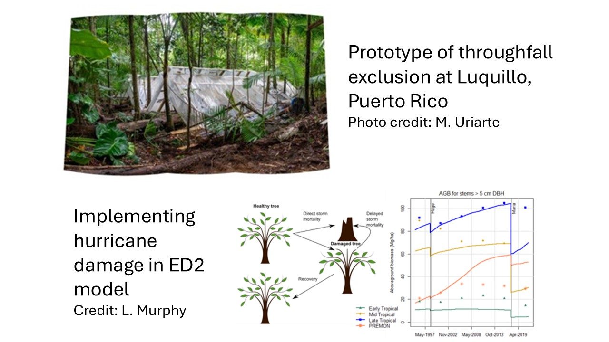
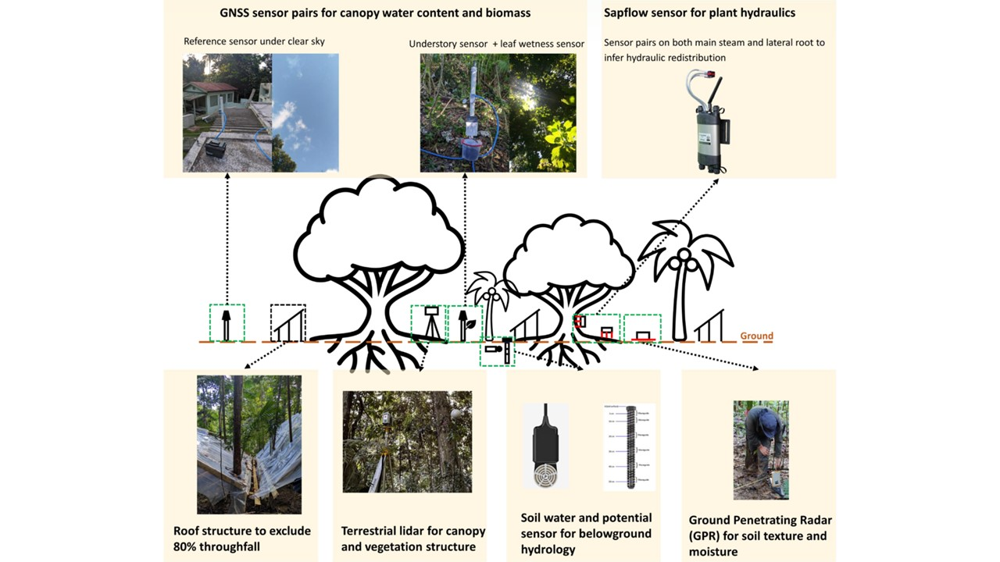
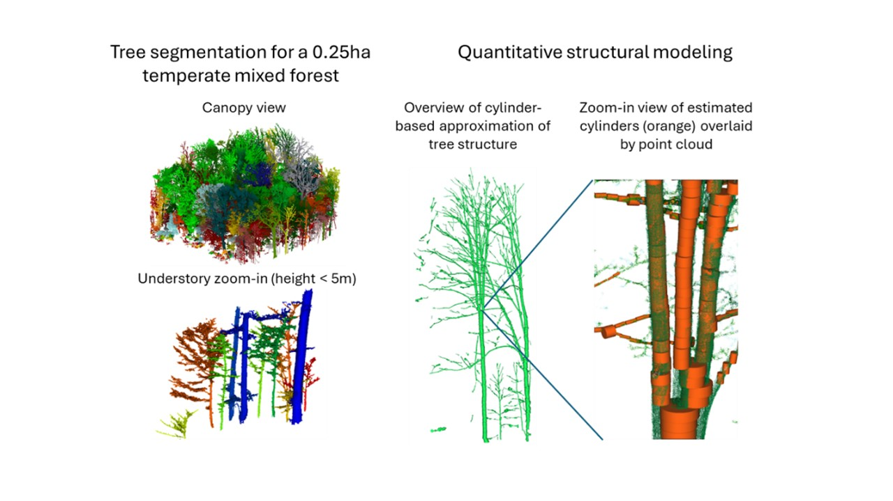
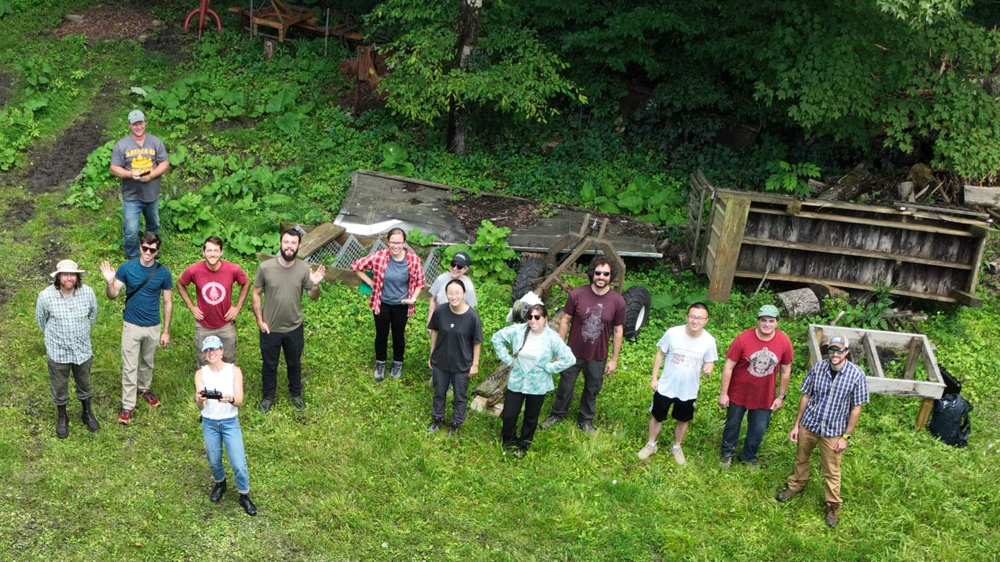
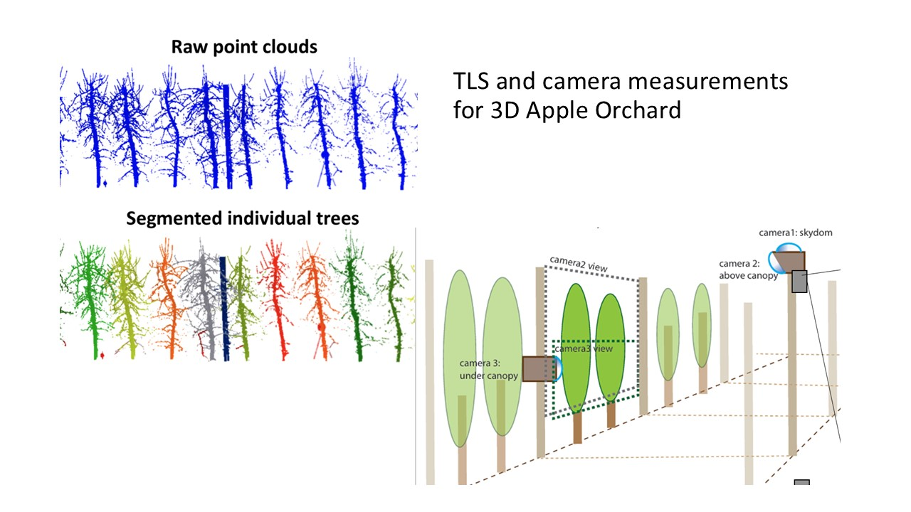

We work at the interface of ecology, Earth system science, and remote sensing —
combining field observation with process-based modeling. Our work spans three
connected themes:

## What we do

::: {.grid}

::: {.g-col-12 .g-col-md-4}
::: {.theme-card}
### 🌳 Ecosystem modeling
Process-based models (the ED2 lineage and beyond) that scale plant physiology up
to ecosystem and biosphere dynamics.
:::
:::

::: {.g-col-12 .g-col-md-4}
::: {.theme-card}
### 🛰️ Ecological remote sensing
Lidar, drones, and satellite products to characterize vegetation structure and
function across spatial and temporal scales.
:::
:::

::: {.g-col-12 .g-col-md-4}
::: {.theme-card}
### 🔬 Model–data integration
A ModEx approach that fuses field experiments, observations, and models to make
sharper predictions of ecosystem change.
:::
:::

:::

## Research Projects

> *"The key to prediction and understanding lies in the elucidation of mechanisms
> underlying observed patterns"* — Levin (1992, *Ecology*)

The BioM2 Lab leverages novel ecological data sets, advanced computational tools,
and theoretical analysis to gain insights on the principles and key processes
that predict terrestrial biosphere dynamics. Our research addresses classic
questions across ecological scales: *To what extent do traits determine plant
performance and vital rates? What are the key dimensions of plant functional
diversity? How do biodiversity and environmental heterogeneity interact to
determine large-scale processes such as carbon and water cycles?* We also
develop novel quantitative methods to extract ecologically relevant information
from multi-platform remote sensing products, particularly terrestrial lidar data.

Current lab research revolves around **resilience of tropical forests under
climate change** and **monitoring and modeling temperate forest carbon
sequestration**.

### Resilience of Tropical Forest Under Climate Change

::: {.project-feature}

::: {.project-feature-text}
#### Drought impacts on post-hurricane recovery in tropical forests
Climate change is expected to increase temperatures and lead to stronger
droughts across many regions. Beyond its effects on temperature and
precipitation, climate change is also expected to increase the frequency and/or
intensity of disturbances. Yet our understanding of the effects of climate
stressors, such as drought, on post-disturbance ecosystem recovery is extremely
limited. This **NSF-funded** project is conducting a large-scale throughfall
exclusion experiment in the Luquillo Experimental Forest in Puerto Rico, an
ecosystem that is recovering from the passage of Hurricane Maria in 2017. Data
from this project will complement our understanding of the legacies of tree
damage and post-disturbance forest dynamics under drought. The field data will
be further used to improve a process-based terrestrial biosphere model,
particularly on partial crown damage and recovery and carbon-water coupling in
plant physiology.
:::
:::

::: {.project-feature style="flex-direction: row-reverse;"}

::: {.project-feature-text}
#### MACROCOSM: Monitor And Constrain tROpical eCOsystem Sensitivity to Moisture
How tropical vegetation responds to moisture changes, and how these responses
in turn regulate ecosystem water dynamics, constitutes a major uncertainty in
ecohydrological predictions in Earth System Models. In this **Department of
Energy funded** project, we aim to improve our mechanistic understanding of
plant-mediated ecohydrology by monitoring and modeling ecosystem dynamics at a
new manipulative throughfall exclusion (TFE) experiment at the Luquillo LTER
station, Puerto Rico.
:::
:::

### Monitoring and Modeling Temperate Forest Carbon Sequestration

::: {.project-feature}

::: {.project-feature-text}
#### Measuring temperate carbon stock and dynamics with terrestrial laser scanning
Temperate forests are a globally important carbon sink, absorbing about 0.6 Pg
of carbon every year. Maintaining and boosting temperate forest carbon sinks
through forest management, conservation, and afforestation is a major component
of nature-based climate solutions. This project, supported by both **USDA** and
**NY DEC**, uses repeated TLS scans to monitor aboveground biomass in upstate
NY. Results from the project will improve our mechanistic understanding of
temperate forest carbon storage and sequestration.
:::
:::

### More

::: {.grid}

::: {.g-col-12 .g-col-md-6}

::: {.project-card}

::: {.project-card-body}

#### CoDiFI

[Cornell Digital Forestry Initiative]{.project-card-subtitle}

This project creates a next-generation forestry research hub that provides
resources and expertise for integrating novel remote sensing (e.g. drone,
lidar, etc.) and computational techniques with conventional forestry
measurements across a range of departments at Cornell.

:::

:::

:::

::: {.g-col-12 .g-col-md-6}

::: {.project-card}

::: {.project-card-body}

#### 3D Apple Orchard

In collaboration with computer scientists, this project quantifies 3D
vegetative growth and light environment for orchard trees with terrestrial
lidar and computational modeling. The project is funded by the Cornell
Institute of Digital Agriculture (CIDA).

:::

:::

:::

:::

::: {.callout-note appearance="simple"}
**Interested in joining?** See the [Team page](team.qmd) for opportunities for
undergraduates, graduate students, and postdocs.
:::

## Publications

*(Bold names are BioM2 Lab members at the time of publication. Cross-checked
against Xiangtao's [ORCID record](https://orcid.org/0000-0002-9402-9474) and
Crossref on 2026-07-01.)*

::: {.pub-list}

### 2026

- **[Lagged climatic drivers of spongy moth (Lymantria dispar dispar) outbreaks revealed by satellite-based defoliation mapping](https://doi.org/10.1016/j.foreco.2026.123854)** **Cameron J. Scholl**, Christine L. Goodale, **Xiangtao Xu**. *Forest Ecology and Management*.
- **[Mechanisms and scales in modeling forest responses to changing disturbance regimes](https://doi.org/10.1111/nph.71384)** **Xiangtao Xu**, **Cameron Scholl**, **Yixin Ma**, Evan Gora, Maria Uriarte, William R. L. Anderegg, Yanlan Liu, **Tao Han**, Yiqi Luo, Charles D. Koven, Winslow D. Hansen, Douglas C. Morton. *New Phytologist*.
- **[Increasing atmospheric dryness and storms accelerates biomass turnover in Amazonian forests](https://doi.org/10.1038/s41558-026-02639-4)** **Donghai Wu**, Yongshi Zhou, Yanlei Feng, Evan M. Gora, Marcos Longo, Robinson I. Negrón-Juárez, Sassan S. Saatchi, Yanlan Liu, **Yixin Ma**, Douglas C. Morton, Nate G. McDowell, Yiqi Luo, **Xiangtao Xu**. *Nature Climate Change*.
- **[Amazon rainforests are rejuvenating their canopies by producing more photosynthetically efficient young leaves under climate change](https://doi.org/10.1038/s41477-026-02240-9)** Xueqin Yang, Jie Tian, Philippe Ciais, Liming Zhou, Peter B. Reich, Jin Wu, Jiali Shang, Jérôme Chave, Julien Lamour, Isabelle Maréchaux, Yongshuo H. Fu, Jing Ming Chen, Jane Liu, Shengli Tao, Xiangming Xiao, **Xiangtao Xu**, Yongxian Su, Haicheng Zhang, Zaichun Zhu, Yao Zhang, Dalei Hao, Lei Chen, Qiang Liu, Raffaele Lafortezza, Kai Yan, Peng Li, Xing Li, Patrick Meir, Hui Liu, Damien Bonal, Bruce W. Nelson, Hao Tang, Jingrui Wang, Kailiang Yu, Wenping Yuan, Shuo Wang, Xiuzhi Chen. *Nature Plants*.
- **[Taller Trees Experienced Less Crown Damage During a Severe Hurricane in a Tropical Forest](https://doi.org/10.1111/gcb.70709)** **Tao Han**, António Ferraz, Dingyi Fang, Tian Zheng, Roi Ankori‐Karlinsky, Gabriel Arellano, Douglas Morton, Jess K. Zimmerman, Michael Keller, María Uriarte, **Xiangtao Xu**. *Global Change Biology*.

### 2025

- **[Spatial patterns and future potential of tree species richness and structural diversity in China’s forests](https://doi.org/10.1038/s41559-025-02922-1)** Changjin Cheng, Guoyi Zhou, Xuli Tang, Shaopeng Wang, Yanjun Su, Jin Wu, **Xiangtao Xu**, Wenfang Xu, Fangmei Lin, Yongshi Zhou, Genxu Wang, Junhua Yan, Keping Ma, Sheng Du, Shenggong Li, Shijie Han, Youxin Ma, Juxiu Liu, **Donghai Wu**. *Nature Ecology &amp; Evolution*.
- **[Aligning satellite-based phenology in a deep learning model for improved crop yield estimates over large regions](https://doi.org/10.1016/j.agrformet.2025.110675)** Jiaying Zhang, Kaiyu Guan, Zhangliang Chen, James Hipple, Yizhi Huang, Bin Peng, Sibo Wang, **Xiangtao Xu**, Zhenong Jin, Kejie Zhao, Maxwell Jong. *Agricultural and Forest Meteorology*.
- **[Increasing constraint of aridity on tree intrinsic water use efficiency](https://doi.org/10.1038/s41467-025-62845-0)** Mengjie Wang, Shushi Peng, Zihan Lu, **Xiangtao Xu**, Andrew Felton, Anping Chen. *Nature Communications*.
- **[Trait‐Based Tree Mortality Risk Assessment From the Perspective of Imaging Spectroscopy](https://doi.org/10.1111/gcb.70337)** Meicheng Shen, Kyla Dahlin, **Xiangtao Xu**, Zachary Butterfield. *Global Change Biology*.
- **[Large CO2 removal potential of woody debris preservation in managed forests](https://doi.org/10.1038/s41561-025-01731-2)** Yiqi Luo, Ning Wei, Xingjie Lu, Yu Zhou, Feng Tao, Quan Quan, Cuijuan Liao, Lifen Jiang, Jianyang Xia, Yuanyuan Huang, Shuli Niu, **Xiangtao Xu**, Ying Sun, Ning Zeng, Charles Koven, Liqing Peng, Steve Davis, Pete Smith, Fengqi You, Yu Jiang, Lailiang Cheng, Benjamin Houlton. *Nature Geoscience* ([see correction](https://doi.org/10.1038/s41561-025-01769-2)).
- **[<scp>SIF</scp> research in the tropics: the overlooked vertical dimension and its implications for interpretation and upscaling of photosynthesis](https://doi.org/10.1111/nph.70299)** Ying Sun, **Xiangtao Xu**, **Yixin Ma**. *New Phytologist*.
- **[Constraining Light‐Driven Plasticity in Leaf Traits With Observations Improves the Prediction of Tropical Forest Demography, Structure, and Biomass Dynamics](https://doi.org/10.1029/2025jg008814)** **Yixin Ma**, Paul R. Moorcroft, S. Joseph Wright, Alistair Rogers, Julien Lamour, Kenneth J. Davidson, Shawn P. Serbin, Matteo Detto, **Xiangtao Xu**. *Journal of Geophysical Research: Biogeosciences*.
- **[Degradation and deforestation increase the sensitivity of the Amazon Forest to climate extremes](https://doi.org/10.1088/1748-9326/adc58c)** Marcos Longo, Michael Keller, Lara M Kueppers, Kevin W Bowman, Ovidiu Csillik, António Ferraz, Paul R Moorcroft, Jean Pierre Ometto, Britaldo S Soares-Filho, **Xiangtao Xu**, Mauro L R de Assis, Eric B Görgens, Erik J L Larson, Jessica F Needham, Elsa M Ordway, Francisca R S Pereira, Ekena Rangel Pinagé, Luciane Sato, Liang Xu, Sassan Saatchi. *Environmental Research Letters*.
- **[A Unified Framework to Reconcile Different Approaches of Modeling Transpiration Response to Water Stress: Plant Hydraulics, Supply Demand Balance, and Empirical Soil Water Stress Function](https://doi.org/10.1029/2023ms003911)** Yi Yang, Kaiyu Guan, Bin Peng, Xue Feng, **Xiangtao Xu**, Ming Pan, Brandon P. Sloan, Jingwen Zhang, Wang Zhou, Lingcheng Li, Murugesu Sivapalan, Elizabeth A. Ainsworth, Kimberly A. Novick, Zong‐Liang Yang, Sheng Wang. *Journal of Advances in Modeling Earth Systems*.
- **[The Surface Water and Ocean Topography Mission (SWOT) Prior Lake Database (PLD): Lake Mask and Operational Auxiliaries](https://doi.org/10.1029/2023wr036896)** Jida Wang, Claire Pottier, Cécile Cazals, Marjorie Battude, Yongwei Sheng, Chunqiao Song, Md Safat Sikder, Xiao Yang, Linghong Ke, Manon Delhoume, Marielle Gosset, Rafael Reis Alencar Oliveira, Manuela Grippa, Félix Girard, George H. Allen, **Xiangtao Xu**, Xiaolin Zhu, Sylvain Biancamaria, Laurence C. Smith, Jean‐François Crétaux, Tamlin M. Pavelsky. *Water Resources Research*.
- **[Trade‐off between spring phenological sensitivities to temperature and precipitation across species and space in alpine grasslands over the Qinghai–Tibetan Plateau](https://doi.org/10.1111/nph.70008)** **Xiaoting Li**, Wei Guo, Hao He, Hao Wang, Aimée Classen, **Donghai Wu**, **Yixin Ma**, Yunqiang Wang, Jin‐Sheng He, **Xiangtao Xu**. *New Phytologist*.
- **[Towards sustainable aquaculture in the Amazon](https://doi.org/10.1038/s41893-024-01500-w)** Felipe S. Pacheco, Sebastian A. Heilpern, Claire DiLeo, Rafael M. Almeida, Suresh A. Sethi, Marcela Miranda, Nicholas Ray, Nathan O. Barros, Jucilene Cavali, Carolina Costa, Carolina R. Doria, Joshua Fan, Kathryn J. Fiorella, Bruce R. Forsberg, Marcelo Gomes, Laura Greenstreet, Meredith Holgerson, David McGrath, Peter B. McIntyre, Patricia Moraes-Valenti, Ilce Oliveira, Jean P. H. B. Ometto, Fabio Roland, Adry Trindade, Marta E. Ummus, Wagner C. Valenti, **Xiangtao Xu**, Carla P. Gomes, Alexander S. Flecker. *Nature Sustainability*.

### 2024

- **[Inventorying ponds through novel size-adaptive object mapping using Sentinel-1/2 time series](https://doi.org/10.1016/j.rse.2024.114484)** Denghong Liu, Xiaolin Zhu, Meredith Holgerson, Sheel Bansal, **Xiangtao Xu**. *Remote Sensing of Environment*.
- **[Estimating merchantable and non-merchantable wood volume in slash walls using terrestrial and airborne LiDAR](https://doi.org/gt7gk4)** **Nicholas Cranmer**, **Tao Han**, Brett Chedzoy, Peter J. Smallidge, Colin Beier, Lucas Johnson, **Xiangtao Xu**. *Forest Ecology and Management*.
- **[Two sub‐annual timescales and coupling modes for terrestrial water and carbon cycles](https://doi.org/gt6s44)** Daniel J. Short Gianotti, Kaighin A. McColl, Andrew F. Feldman, **Xiangtao Xu**, Dara Entekhabi. *Global Change Biology*.
- **[AppleQSM: Geometry-Based 3D Characterization of Apple Tree Architecture in Orchards](https://doi.org/gt6scn)** Tian Qiu, Tao Wang, **Tao Han**, Kaspar Kuehn, Lailiang Cheng, Cheng Meng, **Xiangtao Xu**, Kenong Xu, Jiang Yu. *Plant Phenomics*.
- **[Global photosynthetic capacity jointly determined by enzyme kinetics and eco-evo-environmental drivers](https://doi.org/gt6scp)** Zhengbing Yan, Matteo Detto, Zhengfei Guo, Nicholas G. Smith, Han Wang, Loren P. Albert, **Xiangtao Xu**, Ziyu Lin, Shuwen Liu, Yingyi Zhao, Shuli Chen, Timothy C. Bonebrake, Jin Wu. *Fundamental Research*.
- **[Constraining long‐term model predictions for woody growth using tropical tree rings](https://doi.org/gt6scq)** **Xiangtao Xu**, Peter van der Sleen, Peter Groenendijk, Mart Vlam, David Medvigy, Paul Moorcroft, **Daniel Petticord**, **Yixin Ma**, Pieter A. Zuidema. *Global Change Biology*.

### 2023

- **[Observed impacts of large wind farms on grassland carbon cycling](https://doi.org/gt6scr)** **Donghai Wu**, Steven M. Grodsky, Wenfang Xu, Naijing Liu, Rafael M. Almeida, Liming Zhou, Lee M. Miller, Somnath Baidya Roy, Geng Xia, Anurag A. Agrawal, Benjamin Z. Houlton, Alexander S. Flecker, **Xiangtao Xu**. *Science Bulletin*.
- **[Exploring the impacts of unprecedented climate extremes on forest ecosystems: hypotheses to guide modeling and experimental studies](https://doi.org/gsqq3s)** Jennifer A. Holm, David M. Medvigy, Benjamin Smith, Jeffrey S. Dukes, Claus Beier, Mikhail Mishurov, **Xiangtao Xu**, Jeremy W. Lichstein, Craig D. Allen, Klaus S. Larsen, Yiqi Luo, Cari Ficken, William T. Pockman, William R. L. Anderegg, Anja Rammig. *Biogeosciences*.
- **[Leaf angle as a leaf and canopy trait: Rejuvenating its role in ecology with new technology](https://doi.org/gsh5qt)** Xi Yang, Rong Li, Andrew Jablonski, Atticus Stovall, Jongmin Kim, Koong Yi, **Yixin Ma**, Daniel Beverly, Richard Phillips, Kim Novick, **Xiangtao Xu**, Manuel Lerdau. *Ecology Letters*.
- **[Leaf economics fundamentals explained by optimality principles](https://doi.org/grnvjx)** Han Wang, I. Colin Prentice, Ian J. Wright, David I. Warton, Shengchao Qiao, **Xiangtao Xu**, Jian Zhou, Kihachiro Kikuzawa, Nils Chr. Stenseth. *Science Advances*.

### 2022

- **[Reduced ecosystem resilience quantifies fine‐scale heterogeneity in tropical forest mortality responses to drought](https://doi.org/gntmbv)** **Donghai Wu**, German Vargas G., Jennifer S. Powers, Nate G. McDowell, Justin M. Becknell, Daniel Pérez‐Aviles, David Medvigy, Yanlan Liu, Gabriel G. Katul, Julio César Calvo‐Alvarado, Ana Calvo‐Obando, Arturo Sanchez‐Azofeifa, **Xiangtao Xu**. *Global Change Biology*.

### 2021

- **[Plant input does not exert stronger control on topsoil carbon persistence than climate in alpine grasslands](https://doi.org/grr53z)** **Donghai Wu**, **Xiangtao Xu**, Haicheng Zhang. *Ecology Letters*.
- **[Detecting forest response to droughts with global observations of vegetation water content](https://doi.org/gmsfnx)** Alexandra G. Konings, Sassan S. Saatchi, Christian Frankenberg, Michael Keller, Victor Leshyk, William R. L. Anderegg, Vincent Humphrey, Ashley M. Matheny, Anna Trugman, Lawren Sack, Elizabeth Agee, Mallory L. Barnes, Oliver Binks, Kerry Cawse‐Nicholson, Bradley O. Christoffersen, Dara Entekhabi, Pierre Gentine, Nataniel M. Holtzman, Gabriel G. Katul, Yanlan Liu, Marcos Longo, Jordi Martinez‐Vilalta, Nate McDowell, Patrick Meir, Maurizio Mencuccini, Assaad Mrad, Kimberly A. Novick, Rafael S. Oliveira, Paul Siqueira, Susan C. Steele‐Dunne, David R. Thompson, Yujie Wang, Richard Wehr, Jeffrey D. Wood, **Xiangtao Xu**, Pieter A. Zuidema. *Global Change Biology*.
- **[Natural experiments and long-term monitoring are critical to understand and predict marine host–microbe ecology and evolution](https://doi.org/grr53x)** Matthieu Leray, Laetitia G. E. Wilkins, Amy Apprill, Holly M. Bik, Friederike Clever, Sean R. Connolly, Marina E. De León, J. Emmett Duffy, Leïla Ezzat, Sarah Gignoux-Wolfsohn, Edward Allen Herre, Jonathan Z. Kaye, David I. Kline, Jordan G. Kueneman, Melissa K. McCormick, W. Owen McMillan, Aaron O’Dea, Tiago J. Pereira, Jillian M. Petersen, **Daniel F. Petticord**, Mark E. Torchin, Rebecca Vega Thurber, Elin Videvall, William T. Wcislo, Benedict Yuen, Jonathan A. Eisen. *PLOS Biology*.
- **[Leaf surface water, not plant water stress, drives diurnal variation in tropical forest canopy water content](https://doi.org/gkkjqv)** **Xiangtao Xu**, Alexandra G. Konings, Marcos Longo, Andrew Feldman, Liang Xu, Sassan Saatchi, **Donghai Wu**, Jin Wu, Paul Moorcroft. *New Phytologist*.
- **[Recovery: Fast and Slow—Vegetation Response During the 2012–2016 California Drought](https://doi.org/gkmr4d)** Xi Yang, **Xiangtao Xu**, Atticus Stovall, Min Chen, Jung‐Eun Lee. *Journal of Geophysical Research: Biogeosciences*.
- **[Unraveling the relative role of light and water competition between lianas and trees in tropical forests: A vegetation model analysis](https://doi.org/grz554)** Félicien Meunier, Hans Verbeeck, Betsy Cowdery, Stefan A. Schnitzer, Chris M. Smith‐Martin, Jennifer S. Powers, **Xiangtao Xu**, Martijn Slot, Hannes P. T. De Deurwaerder, Matteo Detto, Damien Bonal, Marcos Longo, Louis S. Santiago, Michael Dietze. *Journal of Ecology*.
- **[Monitoring tree-crown scale autumn leaf phenology in a temperate forest with an integration of PlanetScope and drone remote sensing observations](https://doi.org/gkmnwt)** Shengbiao Wu, Jing Wang, Zhengbing Yan, Guangqin Song, Yang Chen, Qin Ma, Meifeng Deng, Yuntao Wu, Yingyi Zhao, Zhengfei Guo, Zuoqiang Yuan, Guanhua Dai, **Xiangtao Xu**, Xi Yang, Yanjun Su, Lingli Liu, Jin Wu. *ISPRS Journal of Photogrammetry and Remote Sensing*.
- **[Trait-Based Modeling of Terrestrial Ecosystems: Advances and Challenges Under Global Change](https://doi.org/gh7qbj)** **Xiangtao Xu**, Anna T. Trugman. *Current Climate Change Reports*.

### 2020

- **[Accelerated terrestrial ecosystem carbon turnover and its drivers](https://doi.org/gkmnwx)** **Donghai Wu**, Shilong Piao, Dan Zhu, Xuhui Wang, Philippe Ciais, Ana Bastos, **Xiangtao Xu**, Wenfang Xu. *Global Change Biology*.
- **[Optimal leaf life strategies determine <i>V</i>c,max dynamic during ontogeny](https://doi.org/ghjsdd)** Matteo Detto, **Xiangtao Xu**. *New Phytologist*.
- **[A catastrophic tropical drought kills hydraulically vulnerable tree species](https://doi.org/gkmnw3)** Jennifer S. Powers, German Vargas G., Timothy J. Brodribb, Naomi B. Schwartz, Daniel Pérez‐Aviles, Chris M. Smith‐Martin, Justin M. Becknell, Filippo Aureli, Roger Blanco, Erick Calderón‐Morales, Julio C. Calvo‐Alvarado, Ana Julieta Calvo‐Obando, María Marta Chavarría, Dorian Carvajal‐Vanegas, César D. Jiménez‐Rodríguez, Evin Murillo Chacon, Colleen M. Schaffner, Leland K. Werden, **Xiangtao Xu**, David Medvigy. *Global Change Biology*.
- **[Allometric scaling laws linking biomass and rooting depth vary across ontogeny and functional groups in tropical dry forest lianas and trees](https://doi.org/gkmnw6)** Chris M. Smith‐Martin, **Xiangtao Xu**, David Medvigy, Stefan A. Schnitzer, Jennifer S. Powers. *New Phytologist*.

### 2019

- **[Tropical carbon sink accelerated by symbiotic dinitrogen fixation](https://doi.org/gkmnw7)** Jennifer H. Levy-Varon, Sarah A. Batterman, David Medvigy, **Xiangtao Xu**, Jefferson S. Hall, Michiel van Breugel, Lars O. Hedin. *Nature Communications*.

:::